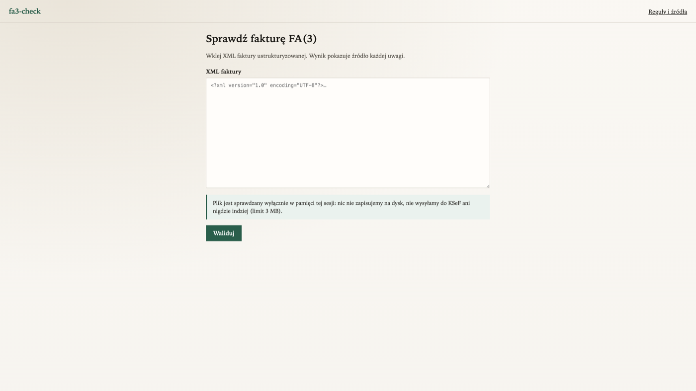
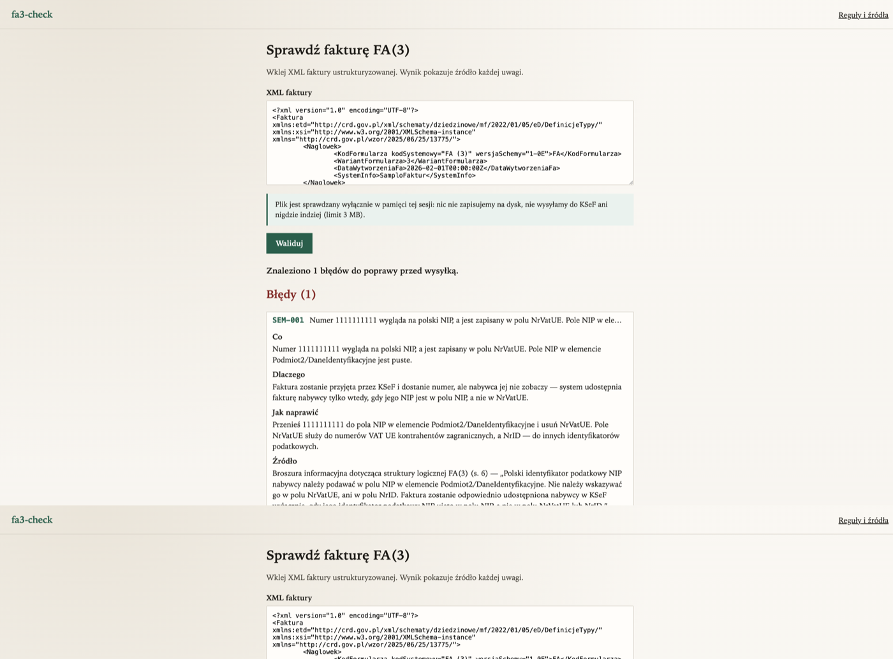
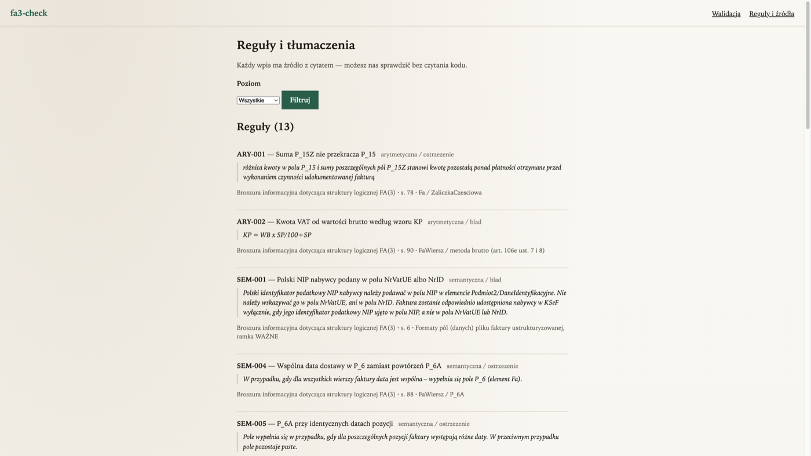

# fa3-check

A validator for Poland’s structured e-invoice format **FA(3)** (KSeF).

You paste the XML. You get back findings with a quote from the official MF source —
not a raw parser message.

**Screenshots / demo page:** [GitHub Pages](https://iakirmon.github.io/ksef-fa3-checker/)
(static preview — the validator itself runs locally).

<p align="center">
  
</p>
<p align="center">
  
</p>
<p align="center">
  
</p>

---

## English

### What it feels like in practice

Imagine this: the buyer’s Polish tax ID sits in `NrVatUE` instead of `NIP`. The schema
is happy. KSeF may even assign a number. The buyer still never sees the invoice.

That is **SEM-001**. Here is the full finding the way the product shows it:

| Part | Text |
|---|---|
| **What** | Number 5252341139 looks like a Polish NIP, but it is stored in `NrVatUE`. The `NIP` field under `Podmiot2/DaneIdentyfikacyjne` is empty. |
| **Why** | KSeF will accept the file and may issue a number, yet the buyer will not see it — the system only exposes the invoice when the buyer’s NIP is in the `NIP` field. |
| **How to fix** | Move the number into `NIP` under `Podmiot2/DaneIdentyfikacyjne` and remove `NrVatUE`. |
| **Source** | FA(3) brochure, p. 6 — the “IMPORTANT” box |
| **Quote** | “Polski identyfikator podatkowy NIP nabywcy należy podawać w polu NIP w elemencie Podmiot2/DaneIdentyfikacyjne…” |

We care less about stacking dozens of rules and more about every finding being
**auditable** and **actionable**.

### Coverage (from the registries)

Generated with `python scripts/pokrycie.py` — not typed from memory:

| Registry | Count |
|---|---|
| Rules total | 13 |
| — technical | 7 |
| — semantic | 4 |
| — arithmetic | 2 |
| Schema translations | 8 |
| Rules with a brochure page number | 6 |
| Rules decidable offline (estimate) | 11 |

### Why two registries

FA(3) is XML Schema 1.0 with the full facet toolkit: lengths, patterns, amount
precision, element order. Duplicating that as “rules” is busywork. Schema hits become
plain-language translations in `tlumaczenia/`.

What Schema 1.0 cannot say stays in `reguly/`: cross-field dependencies, NIP checksums,
VAT arithmetic, and technical KSeF limits documented outside the XSD.

### How we prove the quotes are real

`tests/test_zrodla.py` checks that every entry’s `zrodlo.cytat` appears **verbatim** in
a vendored source file (`korpus/broszura/broszura-fa3.txt` or
`korpus/zrodla/weryfikacja-faktury.md`). For brochure quotes, the page number must match
the nearest page marker. That is a CI gate, not a README promise.

### Honest landscape

Other FA(3) validators exist. [`ksefuj`](https://github.com/ksefuj/ksefuj) is especially
strong when it validates **in the browser** (`libxml2-wasm`) — the XML never leaves the
user’s machine. fa3-check bets on source quotes you can verify and a hardened local
web UI. We do not copy ksefuj’s rules.

### Limits (both directions)

- A green result is **not** a guarantee KSeF will accept the file (global uniqueness,
  rights, session encryption, and similar — see TEC-006/007 and MF’s verification docs).
- KSeF acceptance is **not** a guarantee the invoice is economically correct (the system
  does not fully audit line arithmetic).

### Privacy

The file lives only in request memory. Logs keep size, finding count, and duration —
never NIPs, invoice numbers, or XML snippets. `korpus/zlosliwe/` plus dedicated tests
cover XXE, BOM, entity bombs, and friends.

### Run it

```bash
python3.12 -m venv .venv && .venv/bin/pip install -e ".[dev]"
.venv/bin/python -m fa3check.web
```

Open http://127.0.0.1:8000 — localhost only until you deliberately deploy elsewhere.
Sample XMLs: `korpus/zloty/fa3-przyklad-01.xml` … `-26.xml`.

> GitHub Pages cannot host the FastAPI app (static hosting only). The Pages site is a
> screenshot landing page; the real UI is `python -m fa3check.web`.

### Adding an entry

1. Qualifying question: does the XSD already enforce this with a facet or `choice`?
   If yes → translation, not a rule.
2. Folder under `src/fa3check/reguly/<ID>/` or `tlumaczenia/<ID>/` with `zrodlo.md`
   and fixtures.
3. `@rejestruj` / `@tlumacz`, literal quote from the source.
4. `pytest` — including differential fixtures and the MF golden corpus (zero `BLAD`).

### Sources

Bibliography and brochure map: [docs/zrodla.md](docs/zrodla.md).  
Candidate extract: [docs/reguly-z-broszury.md](docs/reguly-z-broszury.md).

License: MIT.

---

## Polski

### O co tu chodzi

Walidator faktury ustrukturyzowanej **FA(3)** (KSeF).

Wklejasz XML. Dostajesz zastrzeżenia z cytatem ze źródła MF — nie surowy komunikat
parsera.

### Jak to wygląda na żywym przykładzie

Nabywca ma polski NIP zapisany w `NrVatUE` zamiast w `NIP`. Schemat milczy. KSeF może
nawet nadać numer. Nabywca i tak faktury nie zobaczy.

To jest **SEM-001**. Pełne zastrzeżenie tak, jak pokazuje produkt:

| Część | Treść |
|---|---|
| **Co** | Numer 5252341139 wygląda na polski NIP, a jest zapisany w polu `NrVatUE`. Pole `NIP` w `Podmiot2/DaneIdentyfikacyjne` jest puste. |
| **Dlaczego** | Faktura może zostać przyjęta i dostać numer, ale nabywca jej nie zobaczy — system udostępnia fakturę tylko wtedy, gdy NIP jest w polu `NIP`. |
| **Jak naprawić** | Przenieś numer do `NIP` w `Podmiot2/DaneIdentyfikacyjne` i usuń `NrVatUE`. |
| **Źródło** | Broszura FA(3), s. 6 — ramka WAŻNE |
| **Cytat** | „Polski identyfikator podatkowy NIP nabywcy należy podawać w polu NIP w elemencie Podmiot2/DaneIdentyfikacyjne…” |

Nie wygrywamy liczbą reguł. Wygrywamy tym, że przy każdym wpisie stoi cytat, a przy
każdym błędzie zdanie mówiące, co zrobić.

### Pokrycie rejestrów

Z rejestrów (`python scripts/pokrycie.py`), nie z głowy:

| Rejestr | Liczba |
|---|---|
| Reguły łącznie | 13 |
| — techniczna | 7 |
| — semantyczna | 4 |
| — arytmetyczna | 2 |
| Tłumaczenia schematu | 8 |
| Reguły z numerem strony broszury | 6 |
| Reguły rozstrzygalne offline (szacunek) | 11 |

### Dlaczego dwa rejestry

FA(3) to XML Schema 1.0 z pełnym zestawem facetów: długości, wzorce, precyzja kwot,
kolejność elementów. Dublowanie tego regułami mija się z celem — komunikaty schematu
tłumaczymy na język księgowego w `tlumaczenia/`.

Poza schematem zostaje to, czego XSD nie umie: zależności między polami, suma kontrolna
NIP, arytmetyka VAT, limity techniczne KSeF opisane poza XSD (`reguly/`).

### Skąd wiadomo, że cytaty nie są zmyślone

`tests/test_zrodla.py` wymaga, by `zrodlo.cytat` każdego wpisu **występował dosłownie**
w wendorowanym pliku (`korpus/broszura/broszura-fa3.txt` albo
`korpus/zrodla/weryfikacja-faktury.md`). Przy broszurze numer strony musi trafiać w
właściwy znacznik. To bramka CI, nie obietnica w README.

### Stan sztuki — uczciwie

Walidatorów FA(3) jest kilka. [`ksefuj`](https://github.com/ksefuj/ksefuj) ma mocną kartę
tam, gdzie waliduje **w przeglądarce** (`libxml2-wasm`) — XML nie opuszcza komputera
użytkownika. fa3-check stawia na cytaty, które da się sprawdzić, i lokalną stronę
z hartowaniem. Reguł ksefuj nie kopiujemy.

### Ograniczenia w obie strony

- Zielony wynik **nie** gwarantuje przyjęcia przez KSeF (unikalność globalna,
  uprawnienia, szyfrowanie sesji i podobne — TEC-006/007 oraz dokument weryfikacji MF).
- Przyjęcie przez KSeF **nie** gwarantuje, że faktura jest poprawna rachunkowo
  (system nie weryfikuje pełnej arytmetyki pozycji).

### Prywatność

Plik żyje tylko w pamięci żądania. W logach: rozmiar, liczba zastrzeżeń, czas — bez NIP,
numeru faktury i kawałków XML. `korpus/zlosliwe/` i testy pilnują XXE, BOM, bomb
entyfikacyjnych itd.

### Uruchomienie

```bash
python3.12 -m venv .venv && .venv/bin/pip install -e ".[dev]"
.venv/bin/python -m fa3check.web
```

Adres: http://127.0.0.1:8000 — na razie wyłącznie localhost.
Przykłady XML: `korpus/zloty/fa3-przyklad-01.xml` … `-26.xml`.

> GitHub Pages to hosting **statyczny** — nie uruchomi FastAPI. Tam jest podgląd ze
> screenshotami; działający walidator to lokalne `python -m fa3check.web`.

### Jak dodać wpis

1. Pytanie kwalifikujące: czy XSD już to łapie facetem albo `choice`? Jeśli tak —
   tłumaczenie, nie reguła.
2. Katalog `src/fa3check/reguly/<ID>/` albo `tlumaczenia/<ID>/` z `zrodlo.md` i fixture’ami.
3. `@rejestruj` / `@tlumacz`, cytat dosłowny ze źródła.
4. `pytest` — w tym różnica fixture’ów i złoty korpus MF (zero wag `BLAD`).

### Źródła

Bibliografia i mapa broszury: [docs/zrodla.md](docs/zrodla.md).  
Wyciąg kandydatów: [docs/reguly-z-broszury.md](docs/reguly-z-broszury.md).

Licencja: MIT.
